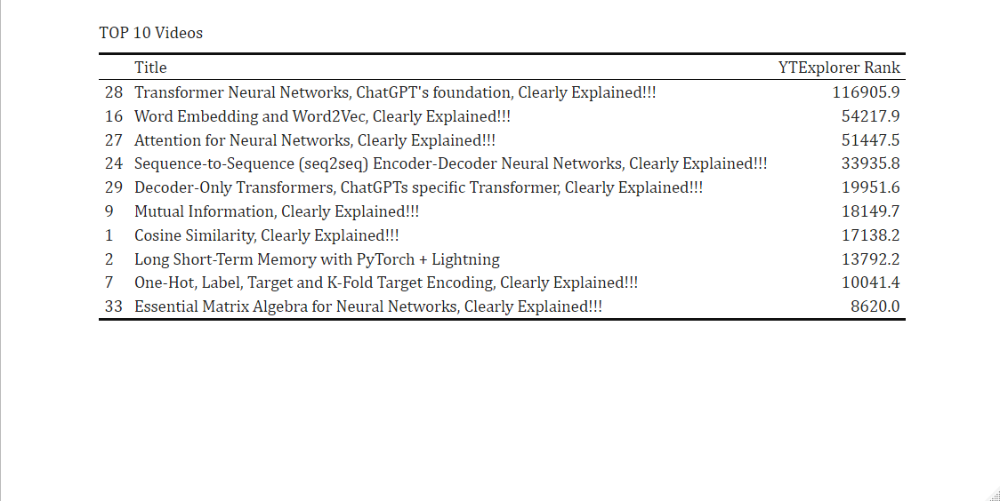
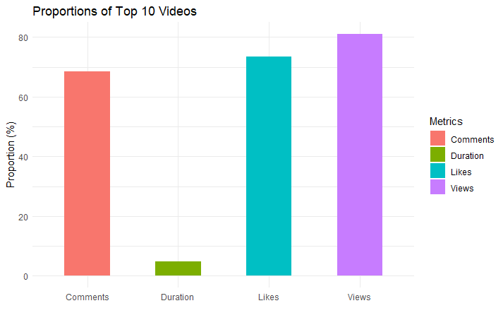
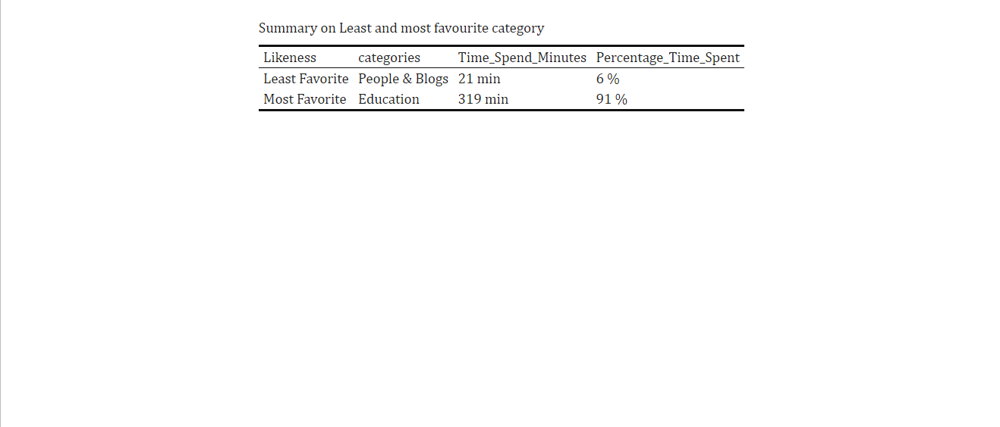
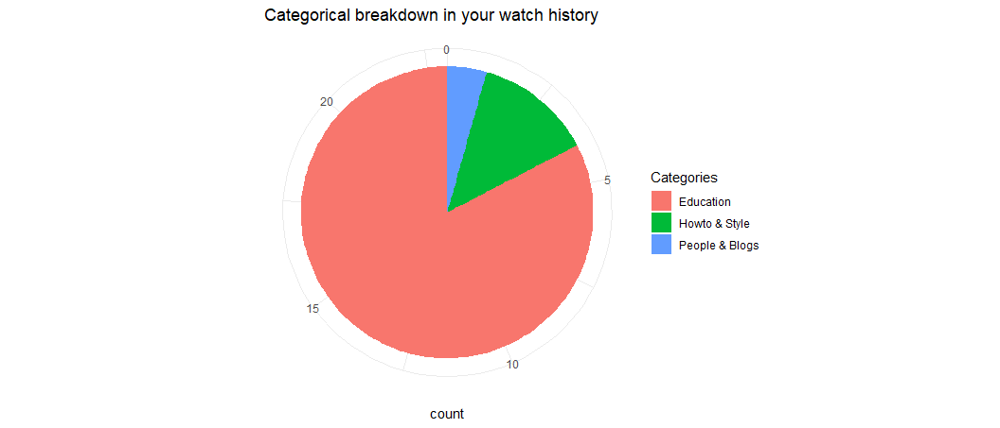
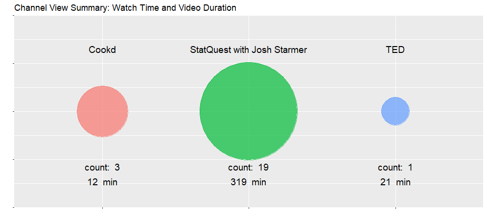

# R PACKAGE: YTExploreR

### Description:

This package wraps the YouTube API into a set of functions designed to assist creators and viewers in better understanding how the free video-sharing website works. Specifically, from the perspective of a new creator, we aim to retrieve statistics that serve as guidelines to start a channel. On the other hand, for those who enjoy using YouTube as viewers, our R package aims to enhance their experience through functions to visualize various metrics. This will help them effortlessly delve into those channels.    

### Before get started

- Get a valid API key on [YouTube API key](https://developers.google.com/youtube/v3/getting-started):
    - You need a Google Account to access the Google API Console, request an API key, and register your application.
    - Create a project in the Google Developers Console and obtain authorization credentials so your application can submit API requests.

### Limitations      

This package relies on the official YouTube API, [YouTube APIs](https://developers.google.com/youtube/v3). Please be aware that there is a quota limit with a default allocation of 10,000 units per day. The quota cost per API request used in this package is 1 unit.

# Let's get started!

### Installation

```
devtools::install_github("YTExploreR.R")
```

### This package wraps YouTube API four primary data stores

- [Channels](https://developers.google.com/youtube/v3/docs/channels/list): contains information about a YouTube channel (views, likes, total videos, playlist id, start date of the channel and  country).          
- [Videos](https://developers.google.com/youtube/v3/docs/videos/list): contains information about a YouTube video (video title, published date, category id, duration, views, likes, comments, etc.)           
- [VideoCategories](https://developers.google.com/youtube/v3/docs/videoCategories/list): resource identifies a category that has been or could be associated with uploaded videos.    
- [Activities](https://developers.google.com/youtube/v3/docs/activities/list): contains information about an action that a particular channel, or user, has taken on YouTube. The actions reported in activity feeds include rating a video, sharing a video, marking a video as a favorite, uploading a video, and so forth.


# Usage 

### Wrapping functions

- **get_channel_stats()**:  This method uses channels API. It receives a string API key and a vector of channel ID's in string format, and retrieves a data frame with the statistics, including:   channel ID, channel title, number subscribers, number views, total videos, playlist ID, channel start date, country, thumbnails_present and engagement_ratio (number of views / number of subscribers).

```
# Set your API key
api_key <- "your_api_key"

# Set your channel IDs
channel_ids <- c('UCtYLUTtgS3k1Fg4y5tAhLbw',
                 'UCCezIgC97PvUuR4_gbFUs5g',
                 'UCfzlCWGWYyIQ0aLC5w48gBQ',
                 'UCNU_lfiiWBdtULKOw6X0Dig',
                 'UCzL_0nIe8B4-7ShhVPfJkgw',
                 'UCLLw7jmFsvfIVaUFsLs8mlQ',
                 'UCiT9RITQ9PW6BhXK0y2jaeg',
                 'UC7cs8q-gJRlGwj4A8OmCmXg',
                 'UC2UXDak6o7rBm23k3Vv5dww',
                 'UCJQJAI7IjbLcpsjWdSzYz0Q')

# Call the function to get channel statistics
channel_stats <- get_channel_stats(api_key, channel_ids)

# Print the resulting data frame
print(channel_stats)
```

- **Get_Video_Detail():** This method uses videos API . It receives one videoID or comma separated multiple videoIDs to retrieve a data frame with details about the video: channel id, video id, video title, video date, category id, duration, definition, views, likes, favorites, comments, year and month. In order to make the function reliable and usable proper try-catch exception and helper functions(extracts time components, ISO 8601 to time in minutes converted) has been added.
```
Get_Video_Detail("Ks-_Mh1QhMc,Ks-_Mh1QhMc", {your API Key})
```
- **Get_Video_Category():** This method uses video categories API, which accepts single or multiple category ids,to get all the category details. It retrieves a data frame with details about the video.- **Get_monthly_uploads():**  This method uses activities API. It receives a YouTube channel id as input and retrieves activities that are carried out by that channel. This includes: uploading videos, creating playlists (of pre-existing videos), likes activity, social activity and more.
```
Get_Video_Category("22,20", {Your API Key})
```
### Functionalities

#### Channel Comparator: This functions help the user to compare 2 or more channel id's base on number of likes, suscribers and total videos. All receive a data frame generated with the get_channel_stats() function in the previous section.

  - **create_bar_subscribers_plot:** Function to create a bar plot to visualize the number of subscribers for 2 or more channel IDs.
  - **create_bar_views_plot:** Function to create a bar plot to visualize the number of views for 2 or more channel IDs.
  - **create_bar_videos_plot:** Function to create a bar plot for the number of videos of 2 or more channel IDs.
 
```
bar_subscribers <- create_bar_subscribers_plot(channel_stats)
bar_views <- create_bar_views_plot(channel_stats)
bar_videos <- create_bar_videos_plot(channel_stats)

# Arrange the plots side by side
grid.arrange(bar_videos, bar_subscribers, bar_views, ncol = 3)
```

  - **create_engagement_plot:** Function to create a barplot to understand the relationship between the number of subscribers and the number of views on the channel, helping to gauge the channel's level of engagement with its audience.

  ```
proportion_plot <- create_engagement_plot(channel_stats)
proportion_plot
```
  - **create_growth_plot:** Creates a bubble plot that shows the relationship between the number of subscribers,number of views and total videos per channel, per content creator adding the start date of the channel. For a meaningful plot, information of more than 5 channels is recommended!

```
growth_plot <- create_growth_plot(channel_stats)
growth_plot
```
- Channel Information:
  
  - **display_channel_info():** This function receives the information from one channel statistics and  retrieves a beautiful table with information for one channel ID. Please just input one channel id!!
 
 ```
channel <- get_channel_stats('your_valid_api', 'UCtYLUTtgS3k1Fg4y5tAhLbw')
display_channel_info(channel)
```
  
#### Rank and Analyse videos in a channel:
 - **get_video_and_rank:**  Ranking videos base on a weighted cumulative metric 0.3(views)+0.2(comments)+0.2(likes)
 - **calculate_proportion:** Calculates proportion of views, likes, duration, comments 
 - **visualize_proportion*:*  Visualizes the proportional of views, likes, duration, comments in bar chart
 - **print_videos:** Helps to print top 10 videos
 - **get_top10_videos:** Co-ordinates all the function above and give a summary of top 10 videos and bar chart on proportions

###### Sample outputs:
```
get_Preference_Breakdown("Ks-_Mh1QhMc,Qf06XDYXCXI")
```



#### Preference Analysis:
- **preprare_data:** Gets video details, groups it by channelID and Category ID and gets the count and number of videos per category. Then Merges it with Category API detail to get category title. Then merges this data with channel API data to get title of the channel.
- **calculate_and_display_summary:** Calculates Least and most favourite Category or categories. Gives summary on all the categories. 
- **visualize_channel and visualize:** It visualizes the channel in bubble plot where size of the bubble is proportional to time they spent on the channel.

###### Sample outputs:
```
get_Preference_Breakdown("Ks-_Mh1QhMc,Qf06XDYXCXI")
```




- Bottom ten videos of a channel 
  - Ranking videos base on a weigthed cumulative metric: 0.4(shares)+0.3(views)+0.2(comments)+0.2(likes)
  - Visualize using a bar chart setting the y-axis with the proprtion (range from 0 to 1.) 
- Monthly performance: 
  - Analizing the uploads per month and related views.
  - Visualize using a line chart.
